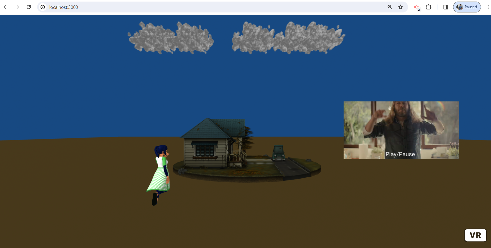

# A-Frame Virtual Reality Environment

This repository contains code for setting up a virtual reality environment using A-Frame.
This project was created using A-Frame, Express.js, and Node.js.

## Installation

### Prerequisites

- Node.js: Ensure you have Node.js installed. If not, you can download it from [nodejs.org](https://nodejs.org/).

1. **Clone the Repository:**
    git clone https://github.com/gourabb8273/AR-VR-Playground.git

2. **Navigate to Project Directory:**
    cd ".\A Frame\"

3. **Install Dependencies:**
    npm install 

4. **Running the Server:**    
    node server

## Features

- **Sky with Clouds:** Enhances the visual experience with a dynamically rendered sky and clouds.
- **3D Model of a House:** A centrally placed 3D model of a house serves as the focal point of the scene.
- **Video Screen:** Adjacent to the house, there's a video screen. Clicking on it allows users to play a video.
- **Interactive Geometry:** A simple geometry object positioned near the house changes its location based on user interaction.

## Virtual Reality Environment Image

