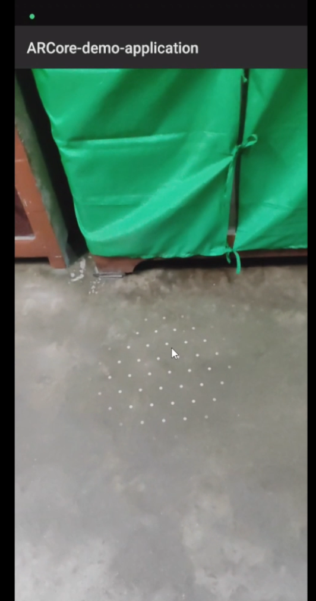
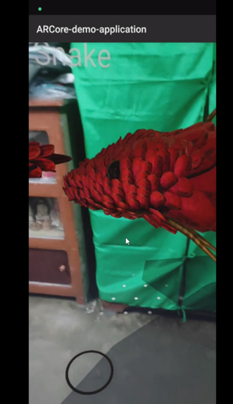
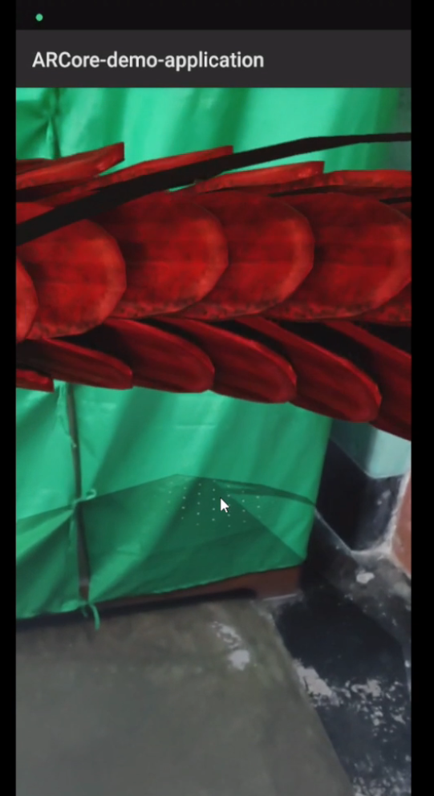

# ARCore Simple AR Application

This repository contains code for developing a simple AR application using ARCore in Android Studio.

## Installation

### Prerequisites

- Android Studio: Ensure you have Android Studio installed. If not, you can download it from [developer.android.com](https://developer.android.com/studio).

1. **Clone the Repository:**
    git clone https://github.com/gourabb8273/AR-VR-Playground.git

2. **Open in Android Studio:**
Open the project in Android Studio.

3. **Build and Run:**
Build and run the application on an Android device or emulator with ARCore support.

## Features

- **Plane Detection:** The application is able to detect plane surfaces in the environment.
- **Object Placement:** Users can place virtual objects on the detected plane surfaces.
- **Ambient Light:** Ambient light is added to enhance the AR experience.

## Usage

1. **Launch the Application:**
Open the application on your Android device or emulator.

2. **Point the Camera:**
Point the camera towards a flat surface to allow ARCore to detect planes.

3. **Place Virtual Objects:**
Tap on the detected plane surfaces to place virtual objects.

4. **Interact with Objects:**
You can interact with the placed virtual objects as per the application functionality.

## Screenshots
We will be adding a snake in the plane through AR experience.

