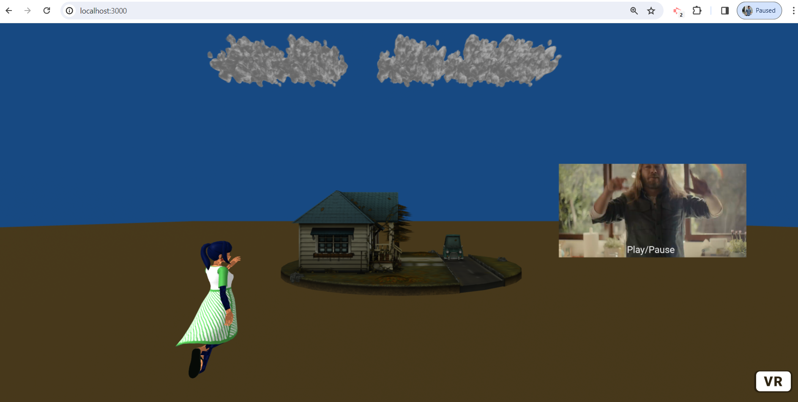
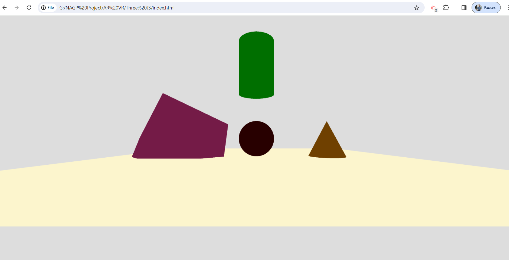

# Three.js 3D Scene

This repository contains code for creating a simple 3D scene using Three.js.

## Installation

### Prerequisites

- Web Browser: Ensure you have a modern web browser installed.

1. **Clone the Repository:**
    git clone https://github.com/gourabb8273/AR-VR-Playground.git

2. **Navigate to Project Directory:**
    cd ".\Three JS\"

3. **Open HTML File:**
Open the `index.html` file in a web browser.

## Features

- **Plane:** Created with a material that doesn't interact with lighting.
- **Box:** Automatically rotates on its x and y axis each tick.
- **Cone:** Created with a material that interacts with lighting.
- **Cylinder:** Automatically changes position from z = -10 to z = 10 based on sin function.
- **Sphere:** Placed at the center of the plane.
- **Ambient Light:** Added to the scene.

## 3D Scene Preview
Using Scroll Up and Down we can change the position of the Object i.e. girl.

